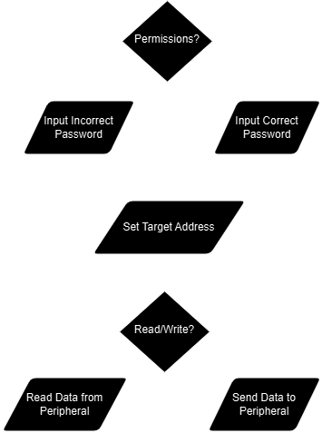

# Partitioned_Memory_Peripheral
VHDL implementation of external single-instance RAM peripheral with OS-relevant memory partitioning

## Peripheral Block Symbol


### Inputs
- 12MHz clock
- Peripheral Reset Enable Bit
- I/O Write (Specifies whether user instruction is a read or write operation)
- Memory Address Instruction Chip-Select
- Data Manipulation Instruction Chip-Select
- Permission Specification Instruction Chip-Select

### Output
- Data read from peripheral during "IN" instruction

## Specifications
- altsyncram single-port RAM instance
    - 16-bit addressability = 65,536 memory locations
    - 16-bits of data stored in each memory location = 128K bytes of data
    - Locations 0x0000 to 0x7FFF reserved for user storage, 0x8000 to 0xFFFF for kernel storage
- Registers

    - **R_W_ADDRESS (Address 0x70), Address** - write-only register that points to memory address/location where read or write operation is performed
    - **R_W_MEM (address 0x71), Read/Write Memory** - read/write register that contains data to be written at user-specified address and data to be retrieved from memory at user-specified address
    - **PERM_B (address 0x72), Permission Bit** - write-only register that contains the permission bit which allows the kernel part of memory to be accessed

## User API

<div align="center">
  
</div>

- Our peripheral uses three I/O addresses to…
    - Set the target data address
    - Read from address or write to address
    - Set permission bit using a password
- Usage Steps:
    - Set required permissions with password
    - Set target address
    - Either…
        - Read from the memory using IN P_R_W, or
        - Write to it using OUT P_R_W

## Example

```asm
ORG 0
    LOAD Password
    OUT Perm         ; enter password to enable kernel permissions
    LOADI &H9029 
    OUT Address      ; specify address in kernel memory
    LOADI 85
    OUT Data         ; write data to kernel memory
    IN Data          ; read data from kernel memory

endless_loop:
    JUMP endless_loop

; I/O Addresses
Address: DW &H70
Data: DW &H71
Perm: DW &H72

; Variables
Password: EQU &H1120