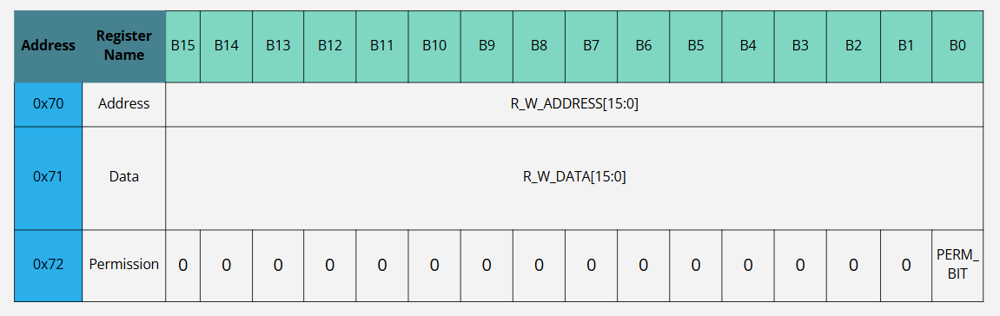

# Partitioned_Memory_Peripheral
VHDL implementation of external single-instance RAM peripheral with OS-relevant memory partitioning

## Peripheral Block Symbol

### Inputs
- 12MHz clock
- Peripheral Reset Enable Bit
- I/O Write (Specifies whether user instruction is a read or write operation)
- Memory Address Instruction Chip-Select
- Data Manipulation Instruction Chip-Select
- Permission Specification Instruction Chip-Select

### Output
- Data read from peripheral during "IN" instruction

## Specifications
- altsyncram single-port RAM instance
    - 16-bit addressability = 65,536 memory locations
    - 16-bits of data stored in each memory location = 128K bytes of data
    - Locations 0x0000 to 0x7FFF reserved for user storage, 0x8000 to 0xFFFF for kernel storage
- Registers

    - **R_W_ADDRESS (Address 0x70), Address** - write-only register that points to memory address/location where read or write operation is performed
    - **R_W_MEM (address 0x71), Read/Write Memory** - read/write register that contains data to be written at user-specified address and data to be retrieved from memory at user-specified address
    - **PERM_B (address 0x72), Permission Bit** - write-only register that contains the permission bit which allows the kernel part of memory to be accessed
