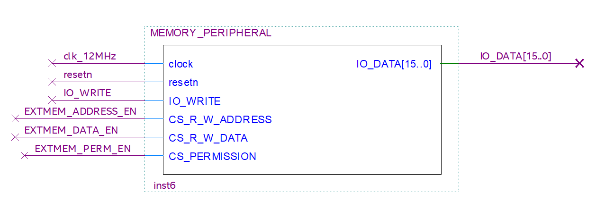

# Partitioned_Memory_Peripheral
VHDL implementation of external single-instance RAM peripheral with OS-relevant memory partitioning

## Peripheral Block Symbol

### Inputs
- 12MHz clock
- Peripheral Reset Enable Bit
- I/O Write (Specifies whether user instruction is a read or write operation)
- Memory Address Instruction Chip-Select
- Data Manipulation Instruction Chip-Select
- Permission Specification Instruction Chip-Select

### Output
- Data read from peripheral during "IN" instruction

